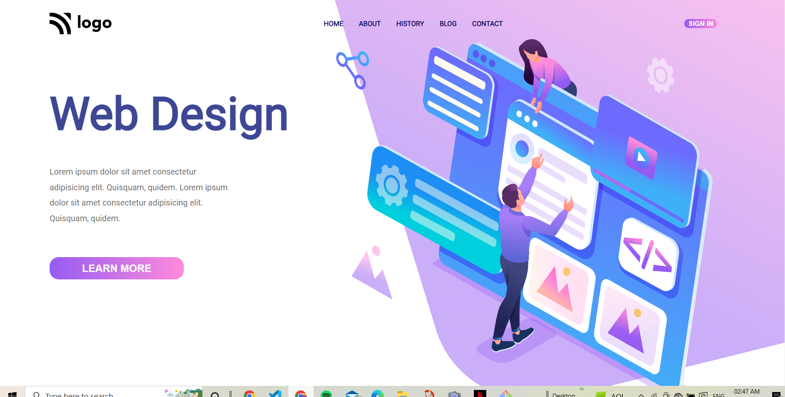

# PROJECT 8

## It is mobile responsive.

## [Netlify Link]()
# Skill gained:
    - How to use background linear-gradient.
    - How to set background image using background-position.
# Time taken:
- 2 hours.
# Screenshot:
